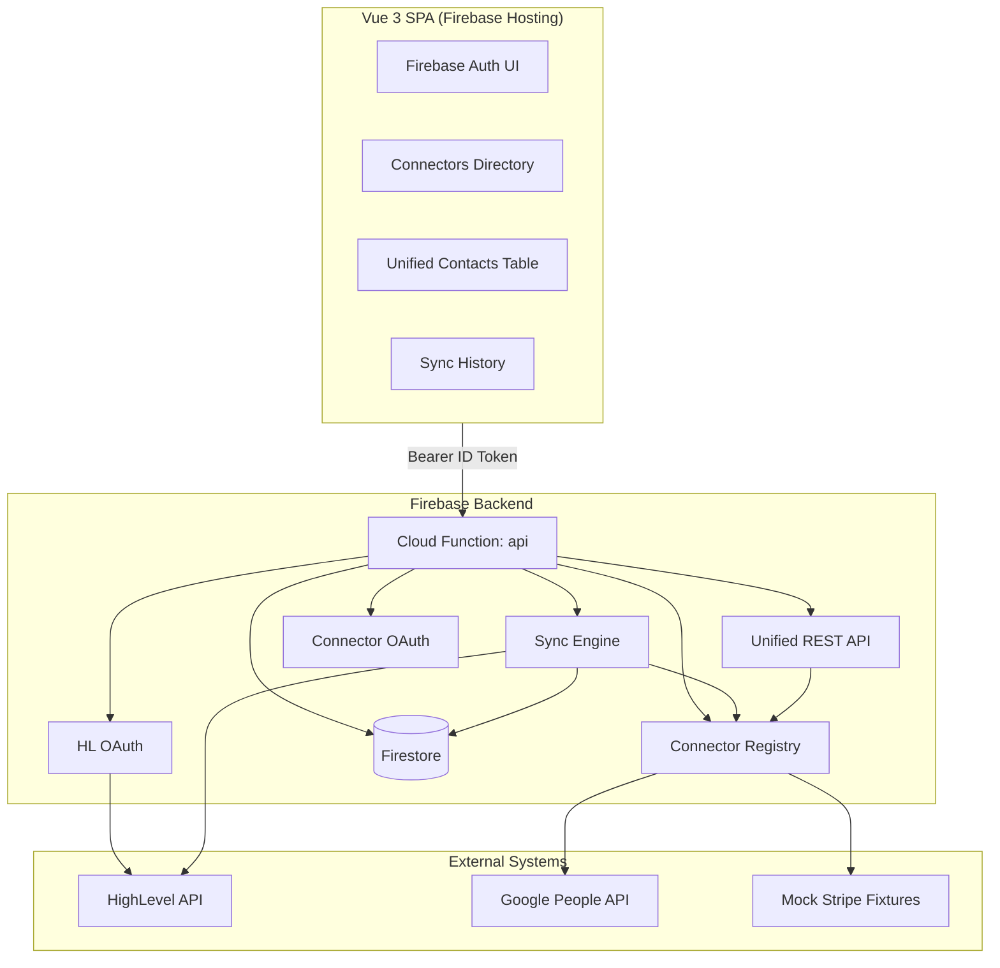

# Product Requirements Document — Unify Integration Platform

## 1. Platform Definition

**Unify** is an AI-native integration platform that provides unified, normalized access to multiple third-party applications through standardized connectors. Users sign in, connect external accounts via OAuth, and the platform fetches, normalizes, and syncs data into HighLevel through a single consistent interface.

This is **not** a workflow builder (Zapier-style). It is a **unified integration layer** where different external systems connect, normalize into a common schema, sync into HighLevel, and are accessed programmatically.

**Conceptual peers:** [Merge.dev](https://www.merge.dev/) · [Membrane](https://getmembrane.com/)

---

## 2. Goals & Success Criteria

| Goal | Success metric |
|------|----------------|
| Unified interface | `GET /contacts` returns same schema regardless of source |
| Extensible connectors | New connector = implement interface + registry entry only |
| Secure auth | Tokens encrypted server-side; OAuth server-side only |
| Reliable sync | Guardrails, per-record error logging, partial success |
| Operable deployment | Firebase Hosting + Functions with documented setup |

---

## 3. System Architecture



### 3.1 Monorepo Structure

```
highlevel/
├── apps/web/                 # Vue 3 + shadcn-vue SPA
├── functions/                # Firebase Cloud Functions (Express API)
├── packages/
│   ├── shared/               # Zod schemas (Contact, Company, Lead)
│   └── connectors/           # Connector interface + implementations
├── docs/PRD.md
└── tests/integration/
```

---

## 4. Unified Schemas

Defined in `@highlevel/shared` with Zod validation.

### Contact

| Field | Type | Description |
|-------|------|-------------|
| externalId | string | Provider-native ID |
| source | string | Connector ID |
| email | string? | Primary email |
| firstName, lastName, fullName | string? | Name fields |
| phone | string? | Primary phone |
| companyName | string? | Associated company |
| tags | string[] | Source tags |
| metadata | object | Provider-specific extras |

### Company

| Field | Type |
|-------|------|
| externalId, source, name | required |
| domain, industry, phone, address | optional |

### Lead

| Field | Type |
|-------|------|
| externalId, source | required |
| status | new \| contacted \| qualified \| converted \| lost |
| campaignId | optional |

---

## 5. Connector Framework

### Interface

Every connector implements:

```typescript
interface Connector {
  meta: ConnectorMeta;
  oauth?: OAuthConfig;
  authenticate(ctx): Promise<boolean>;
  listContacts(ctx, options?): Promise<ListContactsResult>;
  pushContact(ctx, contact): Promise<PushContactResult>;
  mapToUnified(externalRecord): UnifiedContact;
}
```

### Registry

`getConnector(id)` · `getAllConnectors()` · `registerConnector()` — drives API dispatch, UI listing, and sync orchestration.

### Implemented Connectors

| ID | Type | Maps to |
|----|------|---------|
| google-contacts | Real OAuth (PKCE) | Google Person → Contact |
| hubspot | Private App token | HubSpot CRM contact → Contact |
| mock-stripe | Mock (documented) | Stripe Customer → Contact + Company |

---

## 6. Sync Engine

1. Acquire concurrency lock (Firestore `syncLocks`)
2. Rate-limit per user
3. Paginate `listContacts()` until done or 1000 cap
4. Validate each record with `UnifiedContactSchema`
5. Push to HighLevel via API
6. Log per-record failures to `syncErrors`
7. Update `syncRuns` and connection `lastSyncAt`

**Triggers:** manual (`POST /sync`) · webhook simulation (`POST /webhook/simulate`)

---

## 7. Authentication & Security

| Flow | Implementation |
|------|----------------|
| App auth | Firebase Auth (email/password) |
| HighLevel | OAuth 2.0 via Cloud Functions; tokens in `tokens` collection |
| Connectors | OAuth 2.0 + PKCE (Google); Private App token (HubSpot); mock instant-connect |
| Token storage | AES-256-GCM encryption (`TOKEN_ENCRYPTION_KEY`) |
| Client access | Firestore rules — users read own data; tokens server-only |

---

## 8. Frontend Requirements

| Screen | Features |
|--------|----------|
| Login | Sign up / sign in |
| Settings | Connect HighLevel button |
| Connectors | Cards, status, connect/disconnect |
| Connector detail | Last sync, Sync now, webhook simulation |
| Contacts | Unified table, source filter |
| Sync history | Runs + expandable per-record errors |

All async surfaces: loading, error, empty states.

---

## 9. API Endpoints

| Method | Path | Description |
|--------|------|-------------|
| GET | /health | Health check |
| GET | /me | User + HL status |
| GET | /connectors | Connector metadata |
| GET | /connections | User connections |
| DELETE | /connections/:id | Disconnect |
| GET | /contacts?source= | Unified contacts |
| POST | /contacts | Push to source connector |
| POST | /sync | Manual sync |
| POST | /webhook/simulate | Webhook sync |
| GET | /sync-runs | History |
| GET | /sync-runs/:id/errors | Per-record errors |
| GET | /oauth/hl/authorize | Start HL OAuth |
| GET | /oauth/hl/callback | HL callback |
| GET | /oauth/connector/:id/authorize | Start connector OAuth |
| GET | /oauth/connector/:id/callback | Connector callback |

---

## 10. Guardrails

- Max **1000** records per sync
- **60** requests/minute rate limit per user (in-memory; use Redis in production)
- **Concurrency lock** per connection (5 min TTL)
- Resilient payload parsing via Zod `safeParse`

---

## 11. Deployment

- **Local:** Firebase emulators + `pnpm dev:web` (primary demo path)
- **Share:** `pnpm dev:share` — ngrok tunnel; production Auth/Firestore for remote testers
- **Production:** `firebase deploy` — requires Blaze plan for Cloud Functions
- Register OAuth redirect URIs in HL marketplace app and Google Cloud Console
- See [README.md](../README.md) for environment-specific redirect URLs

---

## 12. Evaluation Mapping

| Priority | Criterion | How addressed |
|----------|-----------|---------------|
| 1 | Connector abstraction | `Connector` interface + registry |
| 2 | Schema normalization | Zod in `@highlevel/shared` + mapping modules |
| 3 | E2E sync | Sync engine → HL API |
| 4 | AI-first SDLC | Documented in README |
| 5 | Auth & security | Encrypted tokens, server-side OAuth |
| 6 | Testing | Unit + integration tests (Vitest) |
| 7 | Extensibility | Add connector guide in README |
| 8 | Deployment | Firebase config + README |
| 9 | Code quality | Strict TypeScript monorepo |
| 10 | UI/UX | shadcn-vue components, state handling |

---

## 13. Future / Bonus

- Third connector (real Stripe)
- Real webhook receivers
- Bidirectional sync + conflict resolution
- Field mapping UI
- Connector scaffolding CLI
