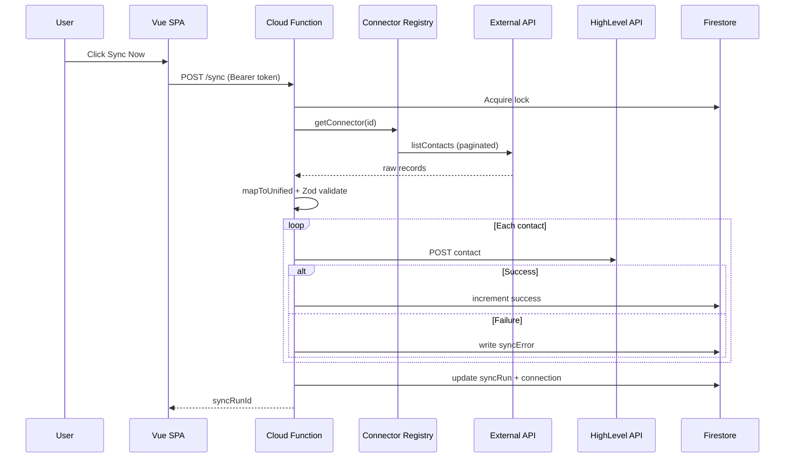
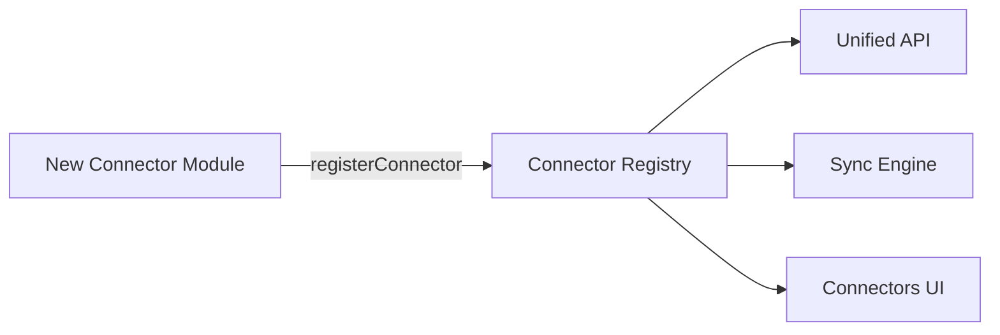

# Architecture Diagrams

## Request Flow — Manual Sync



## Data Model (Firestore)

```mermaid
erDiagram
  users ||--o{ connections : has
  users ||--o{ syncRuns : triggers
  syncRuns ||--o{ syncErrors : contains
  users ||--o| tokens : stores

  users {
    string uid PK
    boolean hlConnected
    string hlLocationId
  }

  connections {
    string id PK
    string userId FK
    string connectorId
    string status
    datetime lastSyncAt
  }

  tokens {
    string id PK
    string userId
    string provider
    string accessToken encrypted
  }

  syncRuns {
    string id PK
    string status
    int recordsSucceeded
    int recordsFailed
  }
```

## Connector Extensibility


